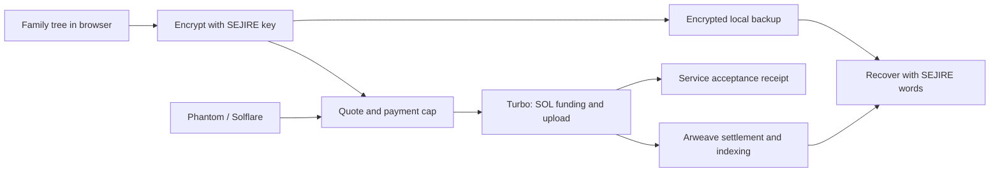

[Открыть SEJIRE — проверочная версия](https://azovskaya.github.io/sejire_arweave_solana/native-admin/) · [Открыть админку](https://azovskaya.github.io/sejire_arweave_solana/native-admin/#/admin)

Публичная статическая проверочная версия. Конфигурация импортируется с проверкой подписей; данные браузера не синхронизируются между компьютерами. Mainnet-отправка и публикация конфигурации выключены.

# SEJIRE · Solana preservation prototype

Build a family tree. Preserve an encrypted archive with your own recovery words.
Rooted in the Kazakh tradition of shezhire, designed for families everywhere.

SEJIRE already includes a genealogy editor, ancestor views, PDF/JSON exports, three interface languages (Kazakh, Russian, English), encrypted Arweave archives and recovery. This repository develops a **Solana-funded preservation flow** on top of that existing product.

**Current stage:** devnet prototype. Local tests and production build pass. Live software-signer uploads, same-item retries and receipt-based recovery in a clean browser have passed; real Phantom/Solflare extensions and actual SOL-funded uploads still require acceptance. A quote or a Turbo acceptance receipt alone does not prove final Arweave settlement.

**Continuing on another Mac with Codex CLI?** Read [the handoff and next test steps](docs/CONTINUE_ON_ANOTHER_MAC.md). Repository instructions are in [AGENTS.md](AGENTS.md). Use the `feat/solana-preservation` branch for this continuation.

## Run locally

Requires Node.js 22.12+ (or a compatible newer version) and npm. The commands below target macOS/Linux and explicitly select devnet without overwriting an existing `.env.local`.

```sh
npm ci --prefix apps/web
npm ci --prefix apps/sponsor
npm run solana:check
npm run solana:dev
```

Open the address printed by Vite. Create a tree without an account or payment wallet. Choose **Save**, create and confirm SEJIRE recovery words, then **Save with Solana**. Phantom or Solflare signs through its own interface. SEJIRE never asks for the payment wallet's recovery phrase.

`solana:check` runs all offline tests, the sponsor type check, lint and a devnet production build. It makes no live upload or payment. `solana:dev` serves only `127.0.0.1:5173` and refuses an occupied port; it does not deploy. Keep that terminal running and open the URL in Chrome on the same Mac as the wallet extension. The complete setup still requires the two `npm ci` commands above, not an install at the repository root.

## Solana continuation package

- [Mac handoff and next steps](docs/CONTINUE_ON_ANOTHER_MAC.md)
- [Real-wallet acceptance checklist and evidence template](docs/SOLANA_WALLET_ACCEPTANCE.md) — still NOT RUN with an actual extension
- [September 29 test report and known issues](docs/verification/2026-09-29-solana-report.md)
- [Public software-signer devnet evidence](docs/verification/2026-09-29-devnet-evidence.json) — zero SOL transfers, no private key or recovery phrase
- [Production dependency audit snapshot](docs/verification/2026-09-29-web-production-audit.json) — unresolved findings, not a clean security certification

The reproducible boundary tests are included in `npm test` and CI. Live network testing remains explicit and separate: `SEJIRE_LIVE_DEVNET=1 npm run test:solana:live --prefix apps/web`; it uploads only synthetic data and refuses SOL transfers. Do not consume the free quota repeatedly to force a paid test.

The default Solana environment is **devnet**, using Turbo's test services. Test uploads are not permanent backups. Keep an encrypted file and the recovery words separately. Mainnet requires an explicit `VITE_SOLANA_NETWORK=mainnet-beta` build and completion of [acceptance checks](docs/SOLANA_PRESERVATION.md).

## Restore an encrypted file on another computer

Choose **Open with 12 words → Open from file**, select the downloaded `sejire-vault-….json`, enter the matching **SEJIRE** recovery words, then choose **Restore archive**. You can select the file before entering the words and retry a mistyped phrase without selecting the file again. A downloaded SEJIRE recovery-words JSON can also fill in the words while retaining the selected archive.

File recovery does not contact Arweave or require a payment wallet. It retains the entire vault, including trees other than the one displayed by the editor. Removing the selected file returns to searching for saved versions online. Chrome download and isolated-profile file recovery were verified on September 29; other browser/device combinations remain acceptance work.

The same form accepts a preservation receipt JSON. Unlike an encrypted backup file, a receipt requires network access to retrieve the archive. It selects the correct network and checks the exact ciphertext hash before decryption; SEJIRE recovery words are still required, but the payment wallet is not.

## How preservation works



Only the encrypted envelope and minimal archive tags are uploaded through this path. Wallet activity, archive identifiers, ciphertext size and timestamps are public. Editor drafts are stored **unencrypted in this browser**. This prototype does not provide anonymous payments, family access roles or a key-inheritance service.

## Hackathon provenance

This is an adaptation of an existing project, **not a claim that the entire product was built during the contest**.

- Original: [azovskaya/Sejire_arweave](https://github.com/azovskaya/Sejire_arweave), source commit `22084ac99b69bf3971c3ed75626074ba9a04d078`.
- Exact imported source tree: `f2d8a4b42e0e628360a72fcb6180e3f98d70e19b`.
- Import baseline in this repository: `37a1a230934e0bbd9cecb2beb4531c542ab1b5a4`.
- New development: Solana browser-wallet flow and payment cap, quote checks, receipt export, clearer international onboarding, vault-preservation fixes and CI.
- No contest application has been submitted from this repository. Team eligibility and founder-provided traction remain to be confirmed.

[Contest research and deadlines](docs/HACKATHON_2026.md) · [Technical integration and acceptance](docs/SOLANA_PRESERVATION.md) · [Product audit and global strategy, Russian](docs/PRODUCT_STRATEGY.ru.md)

## Repository map

| Directory | Purpose |
|---|---|
| `apps/web` | React/TypeScript editor, encryption, recovery and Solana integration |
| `apps/sponsor` | Earlier mock/Kaspi/Turbo cashier; not used by the direct Solana flow |
| `ao/processes` | Earlier AO Tree/Factory processes; separate from private encrypted preservation |
| `packages/schema` | Archive and tree schemas |
| `docs` | Protocol, audit, current scope and historical decisions |
| `presentation` | Earlier pitch materials; review before reusing in a new submission |

Pages workflow builds this repository's `gh-pages` branch with **devnet** settings. A successful workflow alone does not verify GitHub Pages is enabled or that paid uploads work. Historical documents may mention the original deployment; this README and the two new implementation documents define this fork's current status.

## Known release limits

Real extension approval, actual SOL payment and final Arweave settlement are still unverified end to end; the free software-signer and clean-browser receipt-recovery paths have passed. The SDK adds large lazy-loaded chunks and transitive dependency audit findings; see the integration document. Existing cashier concurrency and AO privacy/bootstrap concerns need separate work before those paths are offered as production features. Do not treat a passing build as a security audit.
