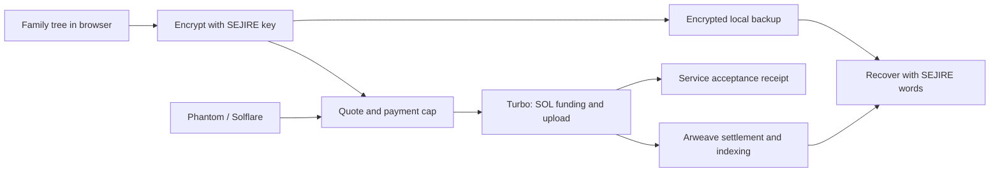

# SEJIRE · Solana preservation prototype

Build a family tree. Preserve an encrypted archive with your own recovery words.
Rooted in the Kazakh tradition of shezhire, designed for families everywhere.

SEJIRE already includes a genealogy editor, ancestor views, PDF/JSON exports, three interface languages (Kazakh, Russian, English), encrypted Arweave archives and recovery. This repository develops a **Solana-funded preservation flow** on top of that existing product.

**Current stage:** devnet prototype. Local tests and production build pass; real wallet signing, paid upload and fresh-device network recovery still require end-to-end acceptance. A quote or a Turbo acceptance receipt alone does not prove final Arweave settlement.

## Run locally

Requires Node.js 22+ and npm.

```sh
npm ci --prefix apps/web
npm ci --prefix apps/sponsor
cp apps/web/.env.solana.example apps/web/.env.local
npm test
npm run web:build
npm run dev --prefix apps/web
```

Open the address printed by Vite. Create a tree without an account or payment wallet. Choose **Save**, create and confirm SEJIRE recovery words, then **Save with Solana**. Phantom or Solflare signs through its own interface. SEJIRE never asks for the payment wallet's recovery phrase.

The default Solana environment is **devnet**, using Turbo's test services. Test uploads are not permanent backups. Keep an encrypted file and the recovery words separately. Mainnet requires an explicit `VITE_SOLANA_NETWORK=mainnet-beta` build and completion of [acceptance checks](docs/SOLANA_PRESERVATION.md).

## How preservation works



Only the encrypted envelope and minimal archive tags are uploaded through this path. Wallet activity, archive identifiers, ciphertext size and timestamps are public. Editor drafts are stored **unencrypted in this browser**. This prototype does not provide anonymous payments, family access roles or a key-inheritance service.

## Hackathon provenance

This is an adaptation of an existing project, **not a claim that the entire product was built during the contest**.

- Original: [azovskaya/Sejire_arweave](https://github.com/azovskaya/Sejire_arweave), source commit `22084ac99b69bf3971c3ed75626074ba9a04d078`.
- Exact imported source tree: `f2d8a4b42e0e628360a72fcb6180e3f98d70e19b`.
- Import baseline in this repository: `37a1a230934e0bbd9cecb2beb4531c542ab1b5a4`.
- New development: Solana browser-wallet flow and payment cap, quote checks, receipt export, clearer international onboarding, vault-preservation fixes and CI.
- No contest application has been submitted from this repository. Team eligibility and founder-provided traction remain to be confirmed.

[Contest research and deadlines](docs/HACKATHON_2026.md) · [Technical integration and acceptance](docs/SOLANA_PRESERVATION.md) · [Product audit and global strategy, Russian](docs/PRODUCT_STRATEGY.ru.md)

## Repository map

| Directory | Purpose |
|---|---|
| `apps/web` | React/TypeScript editor, encryption, recovery and Solana integration |
| `apps/sponsor` | Earlier mock/Kaspi/Turbo cashier; not used by the direct Solana flow |
| `ao/processes` | Earlier AO Tree/Factory processes; separate from private encrypted preservation |
| `packages/schema` | Archive and tree schemas |
| `docs` | Protocol, audit, current scope and historical decisions |
| `presentation` | Earlier pitch materials; review before reusing in a new submission |

Pages workflow builds this repository's `gh-pages` branch with **devnet** settings. A successful workflow alone does not verify GitHub Pages is enabled or that paid uploads work. Historical documents may mention the original deployment; this README and the two new implementation documents define this fork's current status.

## Known release limits

Wallet signing/upload/settlement/independent-device recovery are still unverified end to end. The SDK adds a large lazy-loaded chunk and transitive dependency audit findings; see the integration document. Existing cashier concurrency and AO privacy/bootstrap concerns need separate work before those paths are offered as production features. Do not treat a passing build as a security audit.
